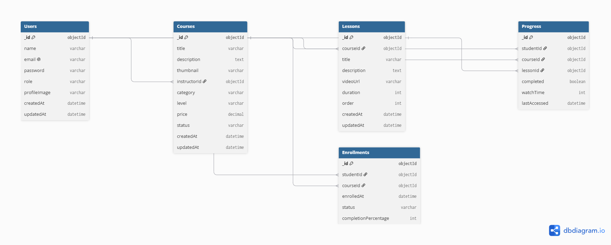

# EduCore — Enterprise Learning Management System

**ProDesk IT Capstone Project | Sprint 13 — Product Planning & System Architecture**

EduCore is a full-stack, enterprise-oriented Learning Management System (LMS) designed to provide a centralized platform for **students, instructors, and administrators**.

The platform enables students to discover and enroll in courses, consume structured learning content, and track their learning progress. Instructors can create and manage courses and lessons, while administrators can manage users, review courses, and oversee the platform.

## Project Overview

### Project Name

**EduCore**

### Project Type

Enterprise Learning Management System (LMS)

### Development Track

**Fullstack Development**

### Project Objective

The objective of EduCore is to build a scalable learning platform that brings course discovery, enrollment, digital learning, instructor course management, progress tracking, and administrative control into a single application.

The project will follow an incremental development approach across four implementation sprints after the planning phase.

# Problem Statement

Traditional learning environments often rely on multiple disconnected systems for course management, student enrollment, learning content delivery, progress tracking, and administration.

This creates difficulties for:

* Students trying to manage their learning journey.
* Instructors managing courses and learning content.
* Administrators monitoring users and course quality.

EduCore addresses this problem by providing a centralized platform with role-based access and structured learning workflows.

# Target Users

EduCore supports three primary user roles.

## Student

Students can:

* Create an account and authenticate securely.
* Browse and search available courses.
* View detailed course information.
* Enroll in courses.
* Access enrolled learning content.
* Watch course lessons.
* Track lesson and course progress.
* Continue learning from their last activity.
* View completed and active courses.

## Instructor

Instructors can:

* Create and manage courses.
* Create and organize lessons.
* Upload course assets.
* Save courses as drafts.
* Submit courses for approval.
* Publish approved courses.
* Edit or remove course content.
* View enrolled students.
* Monitor course-level engagement.

## Administrator

Administrators can:

* Manage users.
* Manage student and instructor accounts.
* Review instructor-created courses.
* Approve or reject courses.
* Manage published course content.
* Monitor platform-level statistics.

# ⭐ Core Features

Features are prioritized to maintain a realistic MVP and prevent scope creep.

## P0 — Mandatory MVP

### Authentication & Authorization

* User registration
* User login
* Secure password handling
* JWT-based authentication
* Protected routes
* Role-Based Access Control (RBAC)
* Logout functionality

### Course Catalog

* Browse courses
* Search courses
* Filter courses
* Course categories
* Course details
* Course difficulty levels

### Enrollment

* Enroll in a course
* View enrolled courses
* Enrollment status
* Student learning dashboard

### Learning Experience

* Course curriculum
* Video lesson player
* Lesson navigation
* Mark lesson as completed
* Course progress calculation
* Continue-learning functionality

### Instructor Portal

* Instructor dashboard
* Create course
* Edit course
* Delete course
* Create lessons
* Edit lessons
* Delete lessons
* Save course as draft
* Submit course for approval

### Administration

* Admin dashboard
* User management
* Course management
* Course approval/rejection
* Basic platform statistics

# P1 — Secondary Features

The following features may be implemented after the core MVP is stable:

* Course ratings
* Course reviews
* Student notifications
* Instructor analytics
* Student learning analytics
* Course completion certificates
* Recently viewed courses
* Advanced course filtering
* Course bookmarks/favorites
* Real-time activity updates

# P2 — Future Enhancements

These features are outside the initial MVP scope and may be considered in later iterations:

* AI-powered course recommendations
* AI-generated quizzes
* AI learning assistant
* Payment gateway integration
* Subscription plans
* Email automation
* Live classes
* Gamification
* Advanced learning analytics
* Achievement/badge system

These features will not be allowed to affect the delivery of the core MVP.

# 🛠️ Technology Stack

## Frontend

* **Next.js**
* **React**
* **Tailwind CSS**
* **shadcn/ui**
* **Zustand**
* **React Hook Form**
* **Zod**

## Backend

* **Node.js**
* **Express.js**
* **MongoDB**
* **Mongoose**
* **JWT**
* **Socket.io**

## Media Management

* **Cloudinary**

Cloudinary will be considered for secure storage and delivery of course thumbnails and video/media assets.

## Development & Documentation

* Git
* GitHub
* Postman
* Figma
* Draw.io / dbdiagram.io

## Deployment

* Vercel
* Render
* MongoDB Atlas

# System Architecture

EduCore will follow a layered full-stack architecture.
                    ┌───────────────────┐
                    │       User        │
                    └─────────┬─────────┘
                              │
                              ▼
                    ┌───────────────────┐
                    │     Next.js       │
                    │   Frontend UI     │
                    └─────────┬─────────┘
                              │
                         REST / HTTP
                              │
                              ▼
                    ┌───────────────────┐
                    │   Express.js API  │
                    │    Node.js        │
                    └─────────┬─────────┘
                              │
                ┌─────────────┼─────────────┐
                │             │             │
                ▼             ▼             ▼
           ┌─────────┐   ┌───────────┐  ┌──────────┐
           │ MongoDB │   │ Cloudinary│  │ Socket.io│
           └─────────┘   └───────────┘  └──────────┘
                │             │             │
                ▼             ▼             ▼
             App Data      Media Assets   Real-time
                                           Updates

### Architecture Responsibilities

**Next.js**

* User interface
* Client-side interactions
* Routing
* Responsive layouts
* Dashboard interfaces

**Express.js**

* REST API
* Authentication
* Authorization
* Business logic
* CRUD operations
* Validation

**MongoDB**

* User data
* Course data
* Lesson data
* Enrollment data
* Progress data

**Cloudinary**

* Course thumbnails
* Video/media assets

**Socket.io**

* Real-time activity updates
* Real-time notifications where required

# Database Architecture

The initial database design will use five primary MongoDB collections.

## 1. Users

_id
name
email
password
role
profileImage
createdAt
updatedAt

Possible roles:

student
instructor
admin

## 2. Courses

_id
title
description
thumbnail
instructorId
category
level
price
status
createdAt
updatedAt

Possible course statuses:

draft
pending
published
rejected

## 3. Lessons

_id
courseId
title
description
videoUrl
duration
order
createdAt
updatedAt

## 4. Enrollments

_id
studentId
courseId
enrolledAt
status
completionPercentage

## 5. Progress

_id
studentId
courseId
lessonId
completed
watchTime
lastAccessed

# Database Relationships

Users
  │
  │ instructorId
  ▼
Courses
  │
  │ courseId
  ▼
Lessons

Users
  │
  │ studentId
  ▼
Enrollments
  │
  │ courseId
  ▼
Courses

Users
  │
  │ studentId
  ▼
Progress
  │
  ├── courseId
  └── lessonId

A finalized ERD will be added to the repository during Sprint 13.

### ERD

# Security & Authorization

EduCore will implement a role-based security architecture.

### Authentication

JWT-based authentication will be used to identify authenticated users.

### Authorization

Access to protected resources will be determined by user role.

Example:

Student
  → Course enrollment
  → Learning content
  → Progress tracking

Instructor
  → Course creation
  → Lesson management
  → Course management

Admin
  → User management
  → Course approval
  → Platform management

### Additional Security Considerations

* Password hashing
* Protected API routes
* Input validation
* Request authorization
* Environment variables for secrets
* CORS configuration
* Secure media upload handling

# API Architecture

The backend will expose RESTful API endpoints.

## Authentication

POST /api/auth/register
POST /api/auth/login
POST /api/auth/logout
GET  /api/auth/me

## Courses
GET    /api/courses
GET    /api/courses/:id
POST   /api/courses
PUT    /api/courses/:id
DELETE /api/courses/:id

## Lessons
GET    /api/courses/:courseId/lessons
POST   /api/courses/:courseId/lessons
PUT    /api/lessons/:id
DELETE /api/lessons/:id

## Enrollment

POST /api/courses/:courseId/enroll
GET  /api/enrollments/my-courses

## Progress

GET  /api/progress/:courseId
POST /api/progress
PUT  /api/progress/:lessonId

## Administration

GET   /api/admin/users
GET   /api/admin/courses
PATCH /api/admin/courses/:id/approve
PATCH /api/admin/courses/:id/reject

#  Frontend Route Structure

The planned application routing structure is:
/
├── /login
├── /register
│
├── /courses
├── /courses/:id
│
├── /dashboard
├── /my-courses
├── /learn/:courseId/:lessonId
│
├── /instructor
├── /instructor/courses
├── /instructor/courses/create
├── /instructor/courses/:id/edit
│
└── /admin
    ├── /users
    ├── /courses
    └── /analytics

Protected routes will require authentication and appropriate role permissions.

# UI/UX Design

The UI/UX will be designed in Figma before implementation.

### Planned Core Screens

1. Authentication
2. Student Dashboard
3. Course Catalog
4. Course Details
5. Learning / Video Player
6. Instructor Dashboard
7. Course Creation
8. Admin Dashboard

The design will include both desktop and mobile-responsive layouts.

### Figma Design

**Figma Link:** `TODO — Add public Figma link`

# Planned Dashboards

## Student Dashboard

The student dashboard will provide:

* Welcome section
* Continue learning
* Enrolled courses
* Course progress
* Recently accessed courses
* Learning statistics

## Instructor Dashboard

The instructor dashboard will provide:

* Total courses
* Published courses
* Draft courses
* Enrolled students
* Course management
* Course creation

## Admin Dashboard

The admin dashboard will provide:

* Total users
* Students
* Instructors
* Total courses
* Pending course approvals
* Platform activity

# Responsive Design

EduCore will follow a responsive-first design approach.

The UI will support:

* Desktop
* Tablet
* Mobile

Important interfaces such as the student dashboard, course catalog, course details, and learning player will have dedicated mobile layouts.

# 🗂️ Repository Structure

The planned repository structure is:
prodesk-capstone-EduCore/
│
├── frontend/
│
├── backend/
│
├── docs/
│   ├── erd.png
│   ├── architecture.png
│   └── screenshots/
│
├── README.md
├── Prompts.md
└── .gitignore

# Five-Week Development Roadmap

## Sprint 13 — Planning & Architecture

**Current Sprint**

* Product Requirements Document
* Feature prioritization
* Database design
* ERD
* System architecture
* Figma UI/UX
* API planning
* Prompt documentation

**Deliverable:** Complete Architecture Blueprint

## Sprint 14 — MVP Development

* Project setup
* Authentication
* User roles
* Database integration
* Course CRUD
* Course catalog
* Enrollment
* Initial student dashboard

**Deliverable:** Functional MVP

## Sprint 15 — Full Feature Completion

* Lesson management
* Video/media integration
* Instructor dashboard
* Admin dashboard
* Progress tracking
* Complete CRUD workflows
* Responsive UI

**Deliverable:** Feature-complete application

## Sprint 16 — AI Integration & UX Polish

* AI-powered feature
* Advanced analytics
* UX improvements
* Real-time functionality
* Performance optimization
* Error handling
* Accessibility improvements

**Deliverable:** Production-ready feature set

## Sprint 17 — QA, CI/CD & Deployment

* Functional testing
* API testing
* Security review
* Production configuration
* CI/CD pipeline
* Frontend deployment
* Backend deployment
* Database deployment
* Final QA
* Final demonstration

**Deliverable:** Production deployment

# Scope Control

To prevent scope creep, the following features are explicitly outside the initial MVP:

* Live video conferencing
* Social networking
* Advanced payment systems
* Complex recommendation engines
* Full gamification
* Large-scale messaging systems
* Advanced AI tutoring

These may be considered only after the core MVP is stable.

#Success Criteria

The EduCore MVP will be considered successful when:

* Users can securely register and authenticate.
* Role-based access is enforced.
* Instructors can create and manage courses.
* Students can browse and enroll in courses.
* Students can access course lessons.
* Learning progress can be recorded and displayed.
* Administrators can manage users and courses.
* The application is responsive.
* The application can be deployed to production.
* Core workflows are tested and documented.

# Documentation

| Document                      | Status         |
| ----------------------------- | -------------- |
| Product Requirements Document | 🟡 In Progress |
| Figma UI/UX                   | 🟡 In Progress |
| ERD                           | 🟡 In Progress |
| System Architecture           | 🟡 In Progress |
| API Documentation             | 🟡 Planned     |
| AI Prompts                    | 🟡 Planned     |
| Deployment Documentation      | 🔵 Sprint 17   |

# AI Architecture Documentation

AI-assisted architectural queries and development prompts will be documented separately.

See:

**[Prompts.md](Prompts.md)**

#  Developer

**Anushka Singh**

**Track:** Fullstack Development

**Project:** EduCore — Enterprise Learning Management System

# 📄 Project Status

**Current Phase:** Sprint 13 — Product Planning & System Architecture

**Development Status:** Architecture & UI/UX Planning

> No production application code is required for the current Sprint 13 evaluation.
